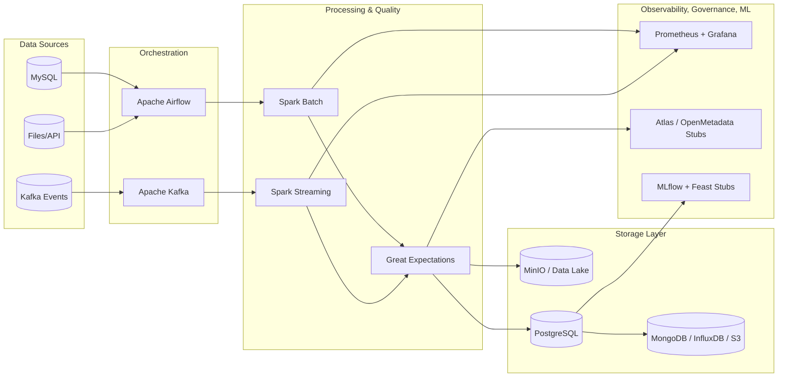
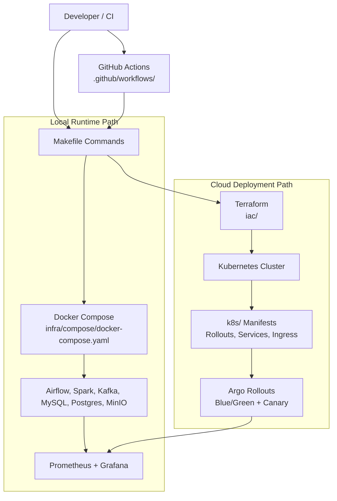
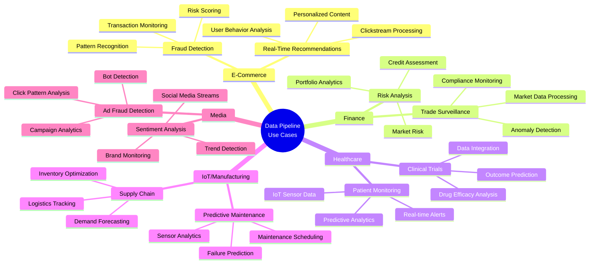

# 🚀 Modern Enterprise Data Platform 🌈

This repository provides a production-ready data platform for both batch and streaming workloads.

This is a complex, enterprise-grade implementation that reflects leading modern data domain trends: lakehouse architecture with Apache Iceberg, unified batch + streaming processing, built-in data quality gates, cloud-native deployment with Kubernetes and Terraform, progressive delivery patterns, and observability-first operations. It is designed as a realistic platform blueprint rather than a minimal demo.

What you get:

- Batch ingestion with Airflow and Spark.
- Streaming ingestion with Kafka and Spark Structured Streaming.
- Data quality checks with Great Expectations.
- Apache Iceberg table format for ACID analytics tables.
- Storage in MinIO, PostgreSQL, MongoDB, InfluxDB, and optional AWS S3.
- Monitoring with Prometheus and Grafana.
- Governance and ML stubs (Apache Atlas/OpenMetadata, MLflow, Feast).
- Deployment paths for Docker Compose, Kubernetes, and Terraform.

Core stack (ordered by implementation importance): Docker, Kubernetes, Terraform, Python, SQL, Airflow, Spark, Kafka, PostgreSQL, MySQL, MinIO, Apache Iceberg, Great Expectations, Prometheus, Grafana, Bash, Java (Spring Boot workflow API), MongoDB (optional), InfluxDB (optional), Hadoop (optional), MLflow (stub), Feast (stub).

For a fast setup path, see `docs/QUICK_START.md`. Use this README for full architecture and customization details.

Container layout and compose/dockerfile conventions are documented in `infra/README.md`.

Use `Makefile` targets to standardize daily operations:

- `make help` to list all available commands
- `make up`, `make ps`, `make logs`, `make down` for lifecycle operations
- `make kind-deploy`, `make kind-status`, `make kind-smoke`, `make kind-down` for local Kubernetes on Kind
- `make hybrid-up`, `make hybrid-status`, `make hybrid-down` for Kind plus Compose support services
- `make run-wiki` to preview the local wiki site (default `WIKI_PORT=8000`)
- `make validate` for end-to-end project validation
- `make format` for repository formatting

## Current Implementation Snapshot

- CI and CD workflows are split into `.github/workflows/ci.yml` and `.github/workflows/cd.yml`.
- Branch and environment flow is standardized: push `dev` for CI + dev checks, PR to `qa`/`stg`/`prd` for environment-specific CI checks and Helm CD deployment.
- Local Kubernetes is supported with Kind using `k8s/kind/cluster-config.yaml`, `k8s/kind/stack.yaml`, `ops/deploy-kind.sh`, and `ops/kind-smoke.sh`.
- Docker Compose runs two Postgres services: `postgres` (project data on `5432`) and `postgres-conduktor` (Conduktor metadata on `5433`).
- Wiki docs are rendered through `devtools/serve_wiki.py` with Mermaid-compatible markdown rendering.

## Documentation Hub

- Getting started: `docs/QUICK_START.md`
- Local development workflow: `docs/LOCAL_RUNTIME.md`
- System design details: `docs/ARCHITECTURE.md`
- Progressive delivery patterns: `docs/DEPLOYMENT.md`
- Iceberg table format usage: `docs/DATA_LAKEHOUSE.md`
- AWS Well-Architected best practices: `docs/AWS_WELL_ARCHITECTED.md`
- Infra container layout: `infra/README.md`
- Java orchestration API: `java-api/README.md`
- Java API design patterns: `java-api/DESIGN_PATTERNS.md`
- Pipeline design patterns: `pipelines/DESIGN_PATTERNS.md`
- Monitoring setup notes: `pipelines/monitoring/PROMETHEUS_GRAFANA_SETUP.md`

## Infrastructure Containers Layout (Compose)

Source of truth: `infra/compose/docker-compose.yaml` and `infra/README.md`.

- `zookeeper`: Kafka coordination. Port `2181`. Image `confluentinc/cp-zookeeper:7.3.2`.
- `kafka`: Event streaming broker. Port `9092`. Image `confluentinc/cp-kafka:7.3.2`.
- `mysql`: Source OLTP database. Port `3306`. Image `mysql:8.0`.
- `postgres`: Processed/project data store. Port `5432`. Image `postgres:14`.
- `postgres-conduktor`: Conduktor metadata DB. Host mapping `5433 -> 5432`. Image `postgres:14`.
- `minio`: S3-compatible object storage. Ports `9000` and `9001`. Image `minio/minio:latest`.
- `airflow-webserver`: Airflow UI and API. Port `8080`. Build source `infra/dockerfiles/airflow.Dockerfile`.
- `airflow-scheduler`: Airflow scheduler. No host port. Build source `infra/dockerfiles/airflow.Dockerfile`.
- `spark`: Spark runtime for jobs. No host port. Build source `infra/dockerfiles/spark.Dockerfile`.
- `workflow-api`: Java orchestration API. Port `${WORKFLOW_API_PORT:-8081}`. Build source `infra/dockerfiles/workflow-api.Dockerfile`.
- `conduktor`: Kafka management console. Host mapping `8085 -> 8080`. Image `conduktor/conduktor-console:1.28.0`.

Named volumes: `minio_data`, `postgres_data`, `postgres_conduktor_data`.

## High-Level Component Diagram



## Deployment Architecture Diagram



## Operations Quickstart

Use this section when you want to deploy, verify health, and monitor the stack quickly.

1. Start the platform:

```bash
make up
```

1. Verify core services are running:

```bash
make ps
```

1. Verify service endpoints:

- Airflow: [http://localhost:8080](http://localhost:8080)
- Grafana: [http://localhost:3000](http://localhost:3000)
- Prometheus: [http://localhost:9090](http://localhost:9090)
- MinIO Console: [http://localhost:9001](http://localhost:9001)

1. Check logs for failed services:

```bash
make logs
```

1. Run pipelines:

- Enable `batch_ingestion_dag` in Airflow for batch execution.
- Run `make run-batch-job` for ad hoc batch execution.
- Run `make run-kafka-producer` and `make run-streaming-job` for streaming.
- Run `make run-iceberg-demo` to write Spark batch output to Iceberg.

1. Use the runbook:

- See the `Operational Runbook` section for failure triage and recovery steps.

## Component Procedures & Best Practices

### Airflow (Orchestration)

Procedure:

1. Start platform with `make up`.
1. Open Airflow at `http://localhost:8080`.
1. Enable `batch_ingestion_dag` and `streaming_monitoring_dag`.
1. Trigger runs manually first, then rely on schedule.
1. Review task logs before promoting changes.

Best practices:

- Keep DAGs idempotent and parameter-driven.
- Use retries with bounded backoff and clear timeout values.
- Separate heavy compute from orchestration (Airflow coordinates; Spark computes).

### Kafka + Spark Streaming

Procedure:

1. Start producer using `make run-kafka-producer`.
1. Run streaming job using `make run-streaming-job`.
1. Confirm records in downstream storage and monitoring dashboards.
1. Stop producer first when testing controlled shutdown.

Best practices:

- Use explicit schemas and evolve them backward-compatibly.
- Keep partition keys stable for ordering-sensitive workloads.
- Make sinks idempotent to handle retries and restarts.

### Storage (MinIO + PostgreSQL)

Procedure:

1. Validate MinIO buckets and PostgreSQL connectivity after startup.
1. Persist raw payloads first, then transformed outputs.
1. Verify object keys and table row counts after each run.

Best practices:

- Use deterministic object key prefixes by domain/date.
- Retain raw immutable data for replay and audit.
- Add retention policies for transient/intermediate datasets.

### Data Quality (Great Expectations)

Procedure:

1. Run batch ingestion with `runGreatExpectations=true`.
1. Review validation report and failed expectations.
1. Block downstream publish when critical checks fail.

Best practices:

- Version expectation suites alongside pipeline code.
- Distinguish warning checks from release-blocking checks.
- Track quality drift over time, not only per-run pass/fail.

### Governance + ML (Atlas/MLflow/Feast)

Procedure:

1. Register lineage after successful batch processing.
1. Log MLflow runs for every experiment/config change.
1. Update feature definitions only through reviewed changes.

Best practices:

- Tie lineage entities to stable dataset identifiers.
- Record experiment metadata and data snapshot references.
- Keep feature contracts explicit and backward-compatible.

### Platform Operations

Procedure:

1. Run `make validate` before merge/deploy.
1. Monitor `make logs` during rollout windows.
1. Use rollback commands from `docs/QUICK_START.md` when health degrades.

Best practices:

- Prefer canary or blue/green for production risk control.
- Maintain runbooks for top failure modes.
- Treat observability and rollback readiness as release gates.

## Table of Contents

1. [High-Level Component Diagram](#high-level-component-diagram)
1. [Deployment Architecture Diagram](#deployment-architecture-diagram)
1. [Operations Quickstart](#operations-quickstart)
1. [Make Procedures](#make-procedures)
1. [Setup Instructions](#setup-instructions)
1. [Operational Runbook](#operational-runbook)
1. [Architecture Overview](#architecture-overview)
1. [Directory Structure](#directory-structure)
1. [Components & Technologies](#components--technologies)
1. [Configuration & Customization](#configuration--customization)
1. [Example Applications](#example-applications)
1. [Troubleshooting & Further Considerations](#troubleshooting--further-considerations)
1. [Contributing](#contributing)
1. [License](#license)
1. [Final Notes](#final-notes)
1. [Iceberg / Data Lakehouse Guide](docs/DATA_LAKEHOUSE.md)

## Make Procedures

Use `make` as the primary entry point for project operations.

### Available Make Targets

```bash
make help
```

This prints all supported targets and descriptions from the root `Makefile`.

### Core Lifecycle Commands

```bash
make up
make ps
make logs
```

- `make up`: build and start core services in detached mode
- `make ps`: inspect container health/status
- `make logs`: tail core service logs (`airflow`, `spark`, `kafka`, `postgres`, `mysql`)

Shutdown and cleanup:

```bash
make down
make clean
```

- `make down`: stop services
- `make clean`: stop services and remove volumes

### Validation Commands

Run complete repository validation:

```bash
make validate
```

Run individual checks:

```bash
make validate-compose
make validate-shell
make validate-python
make validate-json
make validate-yaml
make validate-notebook
make validate-format
make validate-terraform
```

### Formatting Commands

Format all supported components:

```bash
make format
```

Or run by scope:

```bash
make format-python
make format-text
make terraform-fmt
```

### Terraform Commands

```bash
make terraform-init
make terraform-validate
```

Use these targets after Terraform changes and before committing infrastructure updates.

### Streaming Commands

```bash
make run-kafka-producer
make run-streaming-job
make run-batch-job
make run-iceberg-demo
```

These targets run producer/batch/streaming Spark jobs inside the compose stack.

### Legacy Command Mapping

- `docker-compose up --build -d` -> `make up`
- `docker-compose ps` -> `make ps`
- `docker-compose logs --tail=200 airflow spark kafka postgres mysql` -> `make logs`
- `docker-compose down` -> `make down`
- `docker-compose down -v` -> `make clean`
- `terraform -chdir=iac fmt -recursive` -> `make terraform-fmt`
- `terraform -chdir=iac validate` -> `make terraform-validate`

## Architecture Overview

The detailed architecture, runtime topology, sequence flows, and CI/CD diagrams are maintained in dedicated docs so the root README stays concise and avoids duplication.

Use these source-of-truth docs:

- Platform architecture and code-reviewed alignment: `docs/ARCHITECTURE.md`
- Progressive delivery and rollout flows: `docs/DEPLOYMENT.md`
- Local runtime and container topology: `infra/README.md` and `docs/LOCAL_RUNTIME.md`
- Java API pattern interactions: `java-api/DESIGN_PATTERNS.md`
- Pipeline pattern topology and smoke harness: `pipelines/DESIGN_PATTERNS.md`

Recommended reading order:

1. `docs/ARCHITECTURE.md` for system context and platform diagrams.
1. `docs/DEPLOYMENT.md` for rollout and delivery diagrams.
1. `docs/LOCAL_RUNTIME.md` for local runtime modes and operational procedures.
1. `java-api/DESIGN_PATTERNS.md` and `pipelines/DESIGN_PATTERNS.md` for code-level design changes.

## Directory Structure

```text
modern-enterprise-data-stack/
  ├── README.md
  ├── docs/LOCAL_RUNTIME.md
  ├── Makefile
  ├── .github/
  │   └── workflows/
  │       ├── ci.yml
  │       └── cd.yml
  ├── .devcontainer/
  ├── docs/
  │   ├── QUICK_START.md
  │   ├── ARCHITECTURE.md
  │   ├── DEPLOYMENT.md
  │   └── DATA_LAKEHOUSE.md
  ├── pipelines/
  │   ├── airflow/
  │   ├── spark/
  │   ├── kafka/
  │   ├── storage/
  │   ├── great_expectations/
  │   ├── governance/
  │   ├── monitoring/
  │   ├── ml/
  │   └── bi_dashboards/
  ├── infra/
  │   ├── compose/
  │   │   ├── docker-compose.yaml
  │   │   └── docker-compose.ci.yaml
  │   ├── dockerfiles/
  │   │   ├── airflow.Dockerfile
  │   │   ├── spark.Dockerfile
  │   │   └── workflow-api.Dockerfile
  │   └── README.md
  ├── iac/
  ├── k8s/
  │   ├── kind/
  │   │   ├── cluster-config.yaml
  │   │   ├── stack.yaml
  │   │   └── README.md
  │   ├── deployment.yaml
  │   ├── services.yaml
  │   ├── ingress.yaml
  │   ├── rollout-blue-green.yaml
  │   └── rollout-canary.yaml
  ├── ops/
  │   ├── deploy-blue-green.sh
  │   ├── deploy-canary.sh
  │   ├── deploy-kind.sh
  │   ├── init_db.sql
  │   ├── setup.sh
  │   ├── kind-smoke.sh
  │   └── operations/
  ├── java-api/
  ├── notebooks/
  │   └── modern-data-stack.ipynb
  ├── web/
  │   ├── index.html
  │   ├── styles.css
  │   └── script.js
  └── devtools/
      └── serve_wiki.py
```

## Components & Technologies

- **Ingestion & Orchestration:**
  - [Apache Airflow](https://airflow.apache.org/) – Schedules batch and streaming jobs.
  - [Kafka](https://kafka.apache.org/) – Ingests streaming events.
  - [Spark](https://spark.apache.org/) – Processes batch and streaming data.

- **Storage & Processing:**
  - [MinIO](https://min.io/) – S3-compatible data lake.
  - [PostgreSQL](https://www.postgresql.org/) – Stores transformed and processed data.
  - [Great Expectations](https://greatexpectations.io/) – Enforces data quality.
  - [AWS S3](https://aws.amazon.com/s3/) – Cloud storage integration.
  - [InfluxDB](https://www.influxdata.com/) – Time-series data storage.
  - [MongoDB](https://www.mongodb.com/) – NoSQL database integration.
  - [Hadoop](https://hadoop.apache.org/) – Big data processing integration.

- **Monitoring & Governance:**
  - [Prometheus](https://prometheus.io/) – Metrics collection.
  - [Grafana](https://grafana.com/) – Dashboard visualization.
  - [Apache Atlas/OpenMetadata](https://atlas.apache.org/) – Data lineage and governance.

- **ML & Data Serving:**
  - [MLflow](https://mlflow.org/) – Experiment tracking.
  - [Feast](https://feast.dev/) – Feature store for machine learning.
  - [BI Tools](https://grafana.com/) – Real-time dashboards and insights.

## Setup Instructions

### Prerequisites

- **Docker** and **Docker Compose** must be installed.
- Ensure that **Python 3.9+** is installed locally if you want to run scripts outside of Docker.
- Open ports required:
  - Airflow: 8080
  - MySQL: 3306
  - PostgreSQL: 5432
  - MinIO: 9000 (and console on 9001)
  - Kafka: 9092
  - Prometheus: 9090
  - Grafana: 3000

### Getting Started

1. **Clone the Repository**

   ```bash
   git clone https://github.com/paulchen8206/Modern-Enterprise-Data-Stack.git
   cd Modern-Enterprise-Data-Stack
   ```

1. **Start the Pipeline Stack**

Use Make to launch all components:

```bash
make up
```

This command will:

- Build custom Docker images for Airflow and Spark.
- Start MySQL, PostgreSQL, Kafka (with Zookeeper), MinIO, Prometheus, Grafana, and Airflow webserver.
- Run Airflow DB migrations and create the Airflow UI admin user at startup (if missing).
- Initialize the MySQL database with demo data (via `ops/init_db.sql`).

1. **Access the Services**
   - **Airflow UI:** [http://localhost:8080](http://localhost:8080)  
     Default login: `airflow_user` / `airflow_pass` (created automatically during `make up`)
     Set up connections:
     - `mysql_default` → Host: `mysql`, DB: `source_db`, User: `user`, Password: `pass`
     - `postgres_default` → Host: `postgres`, DB: `processed_db`, User: `user`, Password: `pass`
   - **MinIO Console:** [http://localhost:9001](http://localhost:9001) (User: `minio`, Password: `minio123`)
   - **Kafka:** Accessible on port `9092`
   - **Prometheus:** [http://localhost:9090](http://localhost:9090)
   - **Grafana:** [http://localhost:3000](http://localhost:3000) (Default login: `admin/admin`)

1. **Run Batch Pipeline**
   - In the Airflow UI, enable the `batch_ingestion_dag` to run the end-to-end batch pipeline.
   - This DAG extracts data from MySQL, validates it, uploads raw data to MinIO, triggers a Spark job for transformation, and loads data into PostgreSQL.

1. **Run Streaming Pipeline**
   - Start the Kafka producer:

     ```bash
     make run-kafka-producer
     ```

   - In another terminal, run the Spark streaming job:

     ```bash
     make run-streaming-job
     ```

   - The streaming job consumes events from Kafka, performs real-time anomaly detection, and writes results to PostgreSQL and MinIO.

1. **Monitoring & Governance**
   - **Prometheus & Grafana:**  
     Use the `monitoring.py` script (or access Grafana) to view real-time metrics and dashboards.
   - **Data Lineage:**  
     The `pipelines/governance/atlas_stub.py` script registers lineage between datasets (can be extended for full Apache Atlas integration).

1. **ML & Feature Store**
   - Use `pipelines/ml/mlflow_tracking.py` to simulate model training and tracking.
   - Use `pipelines/ml/feature_store_stub.py` to integrate with a feature store like Feast.

1. **CI/CD & Deployment**
   - Use `infra/compose/docker-compose.ci.yaml` to set up CI/CD pipelines.
   - Use the `k8s/` directory for Kubernetes deployment manifests.
   - Use the `iac/` directory for cloud deployment scripts.
   - Use the `.github/workflows/` directory for GitHub Actions CI/CD workflows.

### Customization Guidance

This starter implementation is intentionally generic and should be customized for your domain, data contracts, and operating model.

> [!IMPORTANT]
> Note: Be sure to visit the files and scripts in the repository and change the credentials, configurations, and logic to match your environment and use case. Feel free to extend the pipeline with additional components, services, or integrations as needed.

## Operational Runbook

### Health Verification Checklist

- Confirm service states:

  ```bash
  make ps
  ```

- Inspect logs for critical services:

  ```bash
  make logs
  ```

- Validate DAG orchestration in Airflow UI:
  - Ensure `batch_ingestion_dag` and `streaming_monitoring_dag` are unpaused.
  - Confirm latest runs are successful.

- Validate data path:
  - Raw objects appear in MinIO buckets.
  - Processed records are visible in PostgreSQL.
  - Streaming anomalies are present after producer traffic.

### Restart and Recovery

- Restart all services:

  ```bash
  make restart
  ```

- Restart a specific service:

  ```bash
  docker-compose --project-directory . -f infra/compose/docker-compose.yaml restart airflow-webserver
  ```

- Rebuild after configuration changes:

  ```bash
  make up
  ```

- Tear down and clean environment:

  ```bash
  make clean
  ```

### Production Readiness Notes

- Keep infrastructure changes versioned in `k8s/` and `iac/`.
- Promote via CI/CD using `infra/compose/docker-compose.ci.yaml` and `.github/workflows/`.
- Apply credentials and environment-specific values through secrets management, not hardcoded files.

## Configuration & Customization

- **Docker Compose:**
  All services are defined in `infra/compose/docker-compose.yaml`. Adjust resource limits, environment variables, and service dependencies as needed.

- **Airflow:**  
  Customize DAGs in the `pipelines/airflow/dags/` directory. Use the provided PythonOperators to integrate custom processing logic.

- **Spark Jobs:**  
  Edit transformation logic in `pipelines/spark/spark_batch_job.py` and `pipelines/spark/spark_streaming_job.py` to match your data and processing requirements.

- **Kafka Producer:**  
  Modify `pipelines/kafka/producer.py` to simulate different types of events or adjust the batch size and frequency using environment variables.

- **Monitoring:**  
  Update `pipelines/monitoring/monitoring.py` and dashboard definitions in `pipelines/monitoring/` to fit your environment.

- **Governance & ML:**  
  Replace stub implementations in `pipelines/governance/atlas_stub.py` and `pipelines/ml/` with real integrations as needed.

- **CI/CD & Deployment:**  
  Customize CI/CD workflows in `.github/workflows/` and deployment manifests in `k8s/` and `iac/` for your cloud environment.

- **Storage:**

  Data storage options are in the `pipelines/storage/` directory with AWS S3, InfluxDB, MongoDB, and Hadoop stubs. Replace these with real integrations or credentials as needed.

## Example Applications



### Use Case Highlights

- **Real-Time Recommendations:**
  Process clickstream data to generate personalized product recommendations.
- **Fraud Detection:**
  Detect unusual purchasing patterns or multiple high-value transactions in real-time.

### E-Commerce Use Cases

- **Risk Analysis:**
  Aggregate transaction data to assess customer credit risk.
- **Trade Surveillance:**
  Monitor market data and employee trades for insider trading signals.

### Finance Use Cases

- **Patient Monitoring:**
  Process sensor data from medical devices to alert healthcare providers of critical conditions.
- **Clinical Trial Analysis:**
  Analyze historical trial data for predictive analytics in treatment outcomes.

### Healthcare Use Cases

- **Predictive Maintenance:**
  Monitor sensor data from machinery to predict failures before they occur.
- **Supply Chain Optimization:**
  Aggregate data across manufacturing processes to optimize production and logistics.

### IoT and Manufacturing Use Cases

- **Sentiment Analysis:**
  Analyze social media feeds in real-time to gauge public sentiment on new releases.
- **Ad Fraud Detection:**
  Identify and block fraudulent clicks on digital advertisements.

Feel free to use this pipeline as a starting point for your data processing needs. Extend it with additional components, services, or integrations to build a robust, end-to-end data platform.

## Troubleshooting & Further Considerations

- **Service Not Starting:**
  - Run `make ps` to identify unhealthy containers.
  - Run `make logs` for core service logs.
  - Recreate services with `make up`.
- **Airflow Connection Issues:**
  - Verify Airflow connections match values in `infra/compose/docker-compose.yaml`.
  - Validate network resolution from Airflow container to MySQL/PostgreSQL hostnames.
- **Data Quality Errors:**
  - Inspect Great Expectations output in DAG logs.
  - Update expectation suites in `great_expectations/expectations/` to reflect source changes.
- **Streaming Backlog or Lag:**
  - Check Kafka health and topic throughput.
  - Confirm Spark streaming job is active and consuming events.
- **Resource Constraints:**
  - Increase memory/CPU allocation for Docker Desktop or host VM.
  - For production, run Spark and Kafka as managed or scaled cluster services.

## Contributing

Contributions, issues, and feature requests are welcome!

1. Fork the Project
1. Create your Feature Branch (`git checkout -b feature/AmazingFeature`)
1. Commit your Changes (`git commit -m 'Add some AmazingFeature'`)
1. Push to the Branch (`git push origin feature/AmazingFeature`)
1. Open a Pull Request
1. We will review your changes and merge according to the promotion flow (`dev` -> `qa` -> `stg` -> `prd`).

## License

Copyright (c) 2023 paulchen8206@github

## Final Notes

This pipeline is designed for rapid prototyping and production hardening. With targeted configuration and integration work, it can support use cases such as real-time analytics, anomaly detection, predictive maintenance, and ML-enabled decision systems.

If this repository is useful, please consider starring it. Questions, feedback, and suggestions are welcome via [GitHub](https://github.com/paulchen8206).

[**⬆️ Back to top**](#current-implementation-snapshot)
