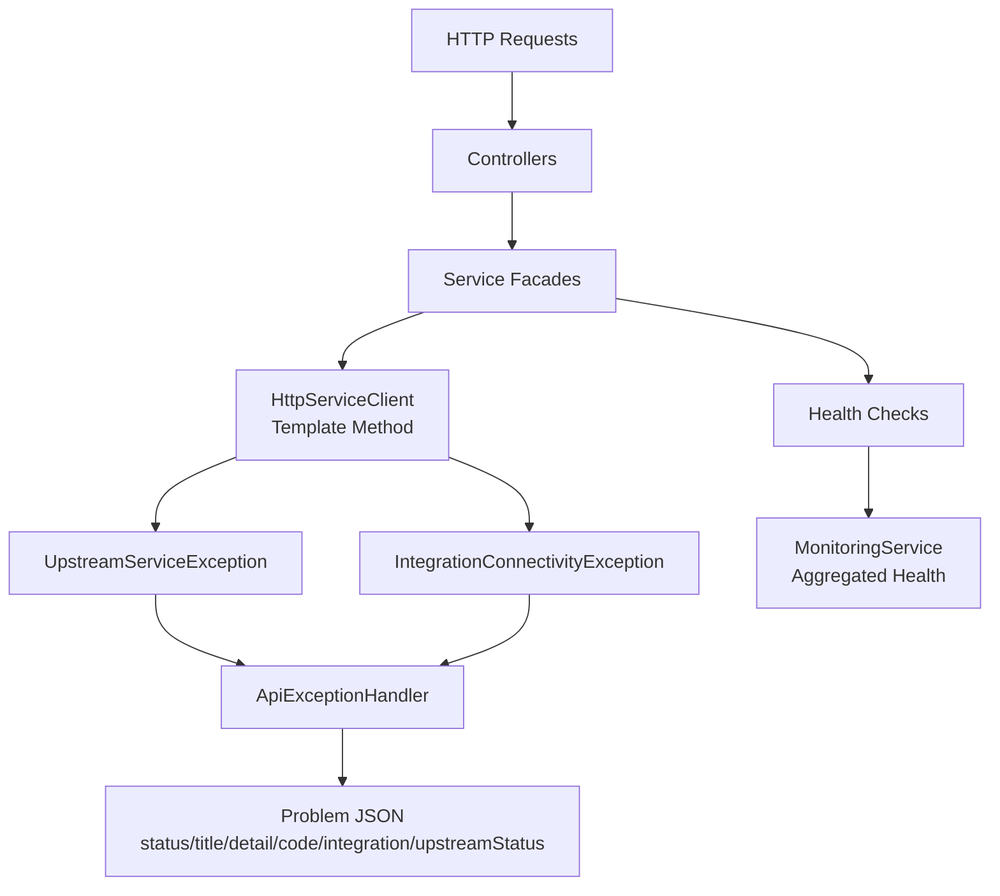
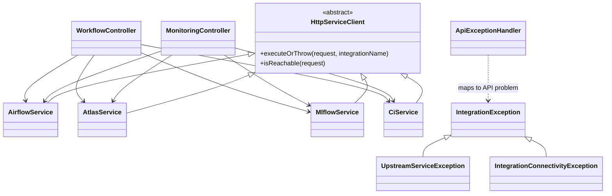

# Java API High-Level Design Patterns

This document captures the primary architectural patterns used in the Java API and how they fit together.

## Pattern Interaction Diagram

## Class Diagram

The class diagram is intentionally selective. It shows the template-method inheritance chain, the integration exception hierarchy, and the main controller-to-service relationships without trying to document every DTO or Spring bean.

## 1) Layered Architecture

Intent:

- Separate transport, orchestration, and external integration concerns.

Applied in:

- Controller layer: `controller/*`
- Service layer: `service/*`

Why it matters:

- Keeps HTTP/web concerns out of business workflows.
- Makes orchestration logic reusable and easier to test.

## 2) Dependency Injection (Inversion of Control)

Intent:

- Construct dependencies outside application code and inject via constructors.

Applied in:

- Spring-managed beans across controllers and services.
- Shared infra beans such as `HttpClient` via config classes.

Why it matters:

- Improves testability and composability.
- Reduces hidden coupling and manual object creation.

## 3) Facade-Style Integration Services

Intent:

- Present a narrow API for each external platform behind one service class.

Applied in:

- `AirflowService`, `AtlasService`, `MlflowService`, `CiService`, `KafkaService`, `StorageService`.

Why it matters:

- Controllers call simple methods and do not need vendor-specific HTTP/Kafka/S3 details.
- Integration behavior can evolve with minimal blast radius.

## 4) Template Method for Outbound HTTP

Intent:

- Centralize shared HTTP execution and error mapping, while allowing services to define request details.

Applied in:

- Base template: `HttpServiceClient`
- Concrete request builders: `AirflowService`, `AtlasService`, `MlflowService`, `CiService`

Why it matters:

- Removes duplicated status-check and transport error handling logic.
- Ensures consistent behavior across all HTTP integrations.

## 5) Exception Hierarchy for Integration Failures

Intent:

- Model dependency failures using domain-specific exception types.

Applied in:

- Base: `IntegrationException`
- Specialized: `UpstreamServiceException`, `IntegrationConnectivityException`
- Mapped centrally in `ApiExceptionHandler`

Why it matters:

- Distinguishes upstream non-2xx responses from connectivity/interruption failures.
- Provides stable, machine-readable API error metadata.

## 6) Centralized Error Translation (Global Handler)

Intent:

- Convert internal exceptions into a stable API error contract in one place.

Applied in:

- `ApiExceptionHandler` with RFC7807-style response shape and dependency-specific metadata (`code`, `integration`, optional `upstreamStatus`).

Why it matters:

- Keeps controllers clean and focused on endpoint behavior.
- Prevents inconsistent error payloads across endpoints.

## 7) Health Aggregation Pattern

Intent:

- Aggregate dependency liveness checks into one system-level view.

Applied in:

- `MonitoringService.health()` and `GET /api/monitor/health`

Why it matters:

- Gives operators a quick dependency matrix and overall status.
- Supports alerting and dashboards from a single endpoint.

## 8) Configuration Object Pattern (Typed Settings)

Intent:

- Bind external configuration into typed objects instead of raw string lookups.

Applied in:

- `AppConfigProperties` and nested classes (`Airflow`, `Kafka`, `Mlflow`, etc.)

Why it matters:

- Early validation of required settings.
- Safer refactoring and better IDE support.

## Pattern Interaction Summary

- Controllers call service facades (Layered + Facade).
- Service facades use shared infrastructure and templates (DI + Template Method).
- Failures become typed integration exceptions (Exception Hierarchy).
- Global handler translates those into uniform API responses (Centralized Error Translation).
- Monitoring uses per-service probes for platform-level visibility (Health Aggregation).

## Extension Guidelines

When adding a new external integration:

1. Create a dedicated service facade for that platform.
2. Reuse `HttpServiceClient` if it is HTTP-based.
3. Throw or propagate `IntegrationException` subtypes for dependency failures.
4. Add a readiness probe in `MonitoringService` if operationally relevant.
5. Add typed config under `AppConfigProperties`.
