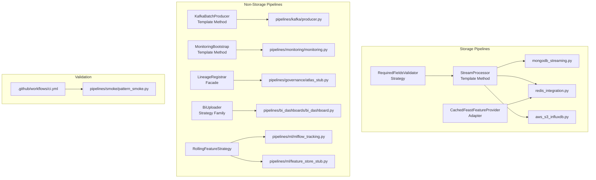

# Pipeline Design Patterns

This document describes the high-level design patterns used in the pipeline scripts.

## Pattern Topology Diagram



## Template Method

- `pipelines/storage/pipeline_patterns.py` defines `StreamProcessor.run()`.
- The template controls the common flow: consume -> validate -> transform -> persist.
- Concrete pipelines only implement `transform()` and `persist()`.

Refactored scripts:

- `pipelines/storage/mongodb_streaming.py`
- `pipelines/storage/redis_integration.py`
- `pipelines/storage/aws_s3_influxdb.py`
- `pipelines/kafka/producer.py` (`KafkaBatchProducer` template)
- `pipelines/monitoring/monitoring.py` (`MonitoringBootstrap` template)

## Strategy

- `RequiredFieldsValidator` is injected into each stream pipeline.
- Validation policies can be replaced without changing processing flow.

## Adapter

- `CachedFeastFeatureProvider` adapts Feast + Redis cache-aside logic to a single `get_features(device_id)` interface.
- `redis_integration.py` uses this adapter and is decoupled from Feast/Redis fetch details.
- `AtlasApiClient` in `pipelines/governance/atlas_stub.py` adapts Atlas auth + HTTP mechanics.
- `GrafanaApiClient` in `pipelines/monitoring/monitoring.py` adapts Grafana REST operations.

## Facade

- `LineageRegistrar` in `pipelines/governance/atlas_stub.py` presents a focused lineage API over Atlas operations.

## Additional Strategy Usage

- `RandomSensorEventGenerator` strategy in `pipelines/kafka/producer.py` isolates event generation from publish loop.
- `MeanMaxRollingStrategy` in `pipelines/ml/mlflow_tracking.py` and `pipelines/ml/feature_store_stub.py` isolates rolling feature math.
- `BiUploader` strategies (`TableauUploader`, `LookerUploader`, `PowerBiUploader`) in `pipelines/bi_dashboards/bi_dashboard.py` isolate per-platform upload behavior.

## Benefits

- Removes duplicated Kafka consume loops and malformed-record checks.
- Makes new streaming sinks faster to add and easier to test.
- Standardizes behavior across storage pipelines while preserving script-level sink logic.

## How to Add a New Streaming Pipeline

1. Subclass `StreamProcessor`.
2. Implement `transform(payload)`.
3. Implement `persist(transformed, raw_payload)`.
4. Provide a validator strategy (for example, `RequiredFieldsValidator([...])`).
5. Create pipeline instance in `if __name__ == "__main__":` and call `run()`.

## Smoke Harness

- Script: `pipelines/smoke/pattern_smoke.py`
- Purpose: validates template/strategy/adapter/facade orchestration with mocked modules and adapters (no external services).
- Run:

```bash
python3 pipelines/smoke/pattern_smoke.py
```
